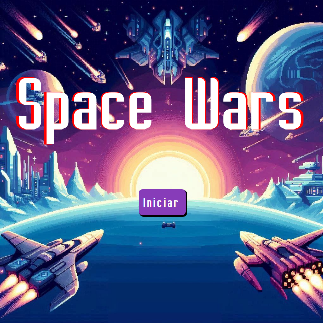
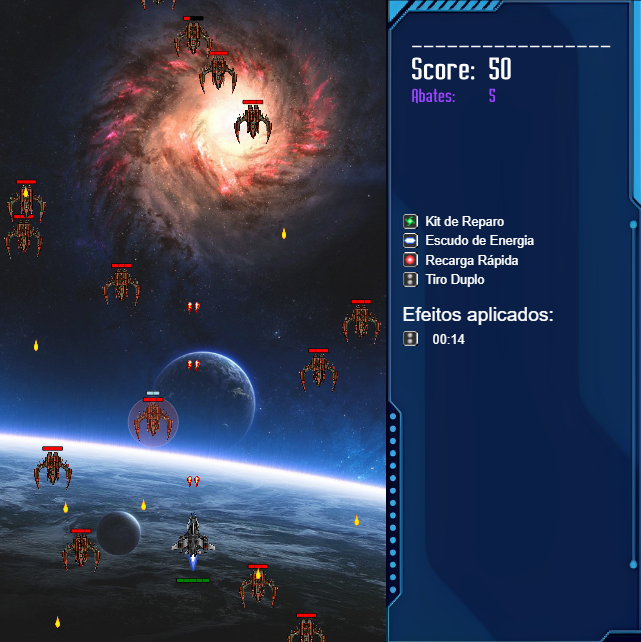
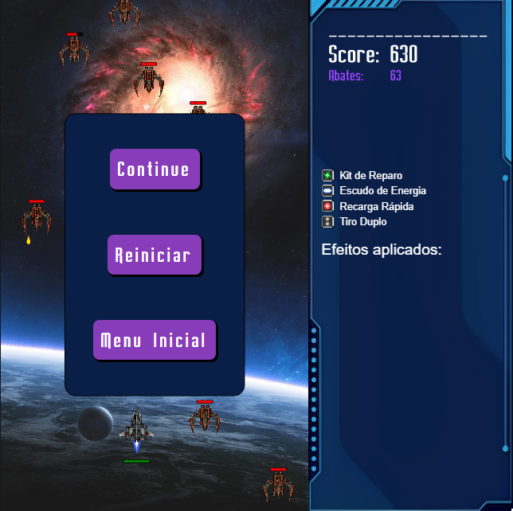
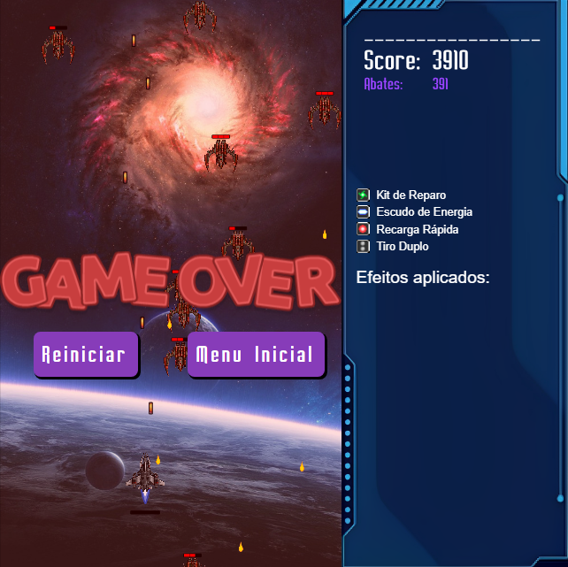
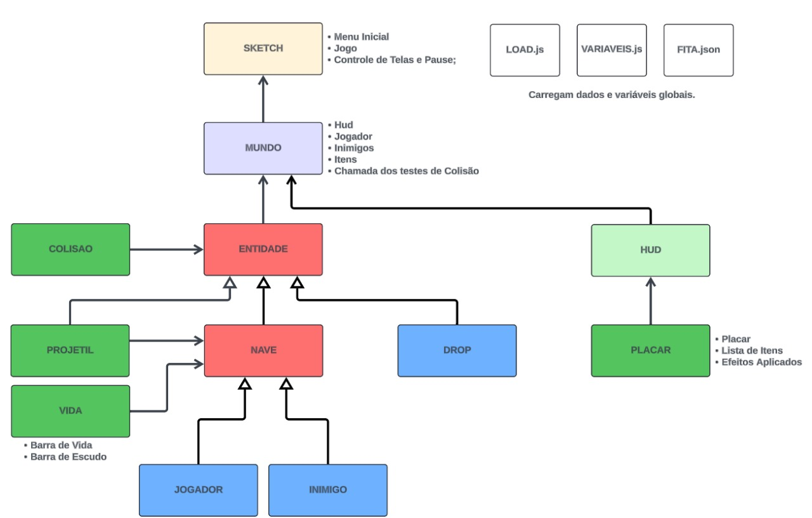

# Space Wars

## Descrição
Este é uma versão atualizada de um clássico jogo de arcade chamado Space Wars, que está sendo desenvolvido para a disciplina de Programação Orientada a Objetos. O objetivo do jogo é destruir todas as naves inimigas antes que elas alcancem a parte inferior da tela ou atinjam a nave do jogador. O jogador controla uma nave que pode se mover para a esquerda, direita, cima e baixo, além de disparar projéteis para destruir os inimigos.

## Funcionalidades
- Controle da nave do jogador com as teclas de seta.
- Disparo de projéteis para destruir naves inimigas.
- Naves inimigas que se movem e disparam de volta.
- Pontuação baseada no número de inimigos destruídos.
- Várias vidas para o jogador.

## Capturas de Tela
### Tela Inicial do Jogo


### Jogo em Progresso


<!-- ### Jogo em Pausa
 -->

### Game Over


## Como Jogar
1. Clone este repositório:
    ```sh
    git clone https://github.com/nestorfranca/Space_Wars.git
    ```
2. Navegue até o diretório do projeto:
    ```sh
    cd Space_Wars
    ```
3. Execute o jogo:
    ```sh
    Space-Wars.html
    ```
## Fluxo de classes
### Update 19/09/2024
 - Implementado coceitos de herança as classes.
<hr>


### Update 01/08/2024
- Implementação anterior sem herança. (Descontinuada).
<hr>


## Controles
- **Seta Esquerda**: Mover a nave para a esquerda.
- **Seta Direita**: Mover a nave para a direita.
- **Seta Cima**: Mover a nave para a cima.
- **Seta Baixo**: Mover a nave para a baixo.
- **Barra de Espaço**: Disparar projétil.

## Requisitos
- Navegador

## Instalação
- Não é necessária

## Contribuição
Contribuições são bem-vindas! Sinta-se à vontade para abrir issues e pull requests para melhorar o jogo.

## Licença
Este projeto está licenciado sob a licença MIT. Veja o arquivo LICENSE para mais detalhes.

## Autor
- [FRANCISCO RICARDO DOS SANTOS SILVA](https://github.com/Ricardo-SS)
- [GUSTAVO ALVES MENDES](https://github.com/Gustavo-A-Mendes)
- [NESTOR FRANCA DE ANDRADE JUNIOR](https://github.com/nestorfranca)
- [PAULO HENRIQUE MEDEIROS DA SILVA](https://github.com/oluaphenrique)
- [WEDRYSON LUCAS XAVIER OLIVEIRA SOUZA](https://github.com/lucasxavier9)
<!-- - [Gustavo-A-Mendes](https://github.com/Gustavo-A-Mendes)
- [lucasxavier9](https://github.com/lucasxavier9)
- [nestorfranca](https://github.com/nestorfranca)
- [oluaphenrique](https://github.com/oluaphenrique)
- [Ricardo-SS](https://github.com/Ricardo-SS) -->


Divirta-se jogando! 🚀